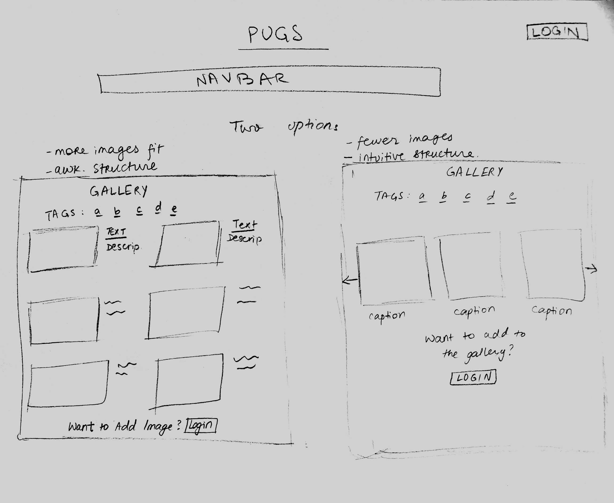
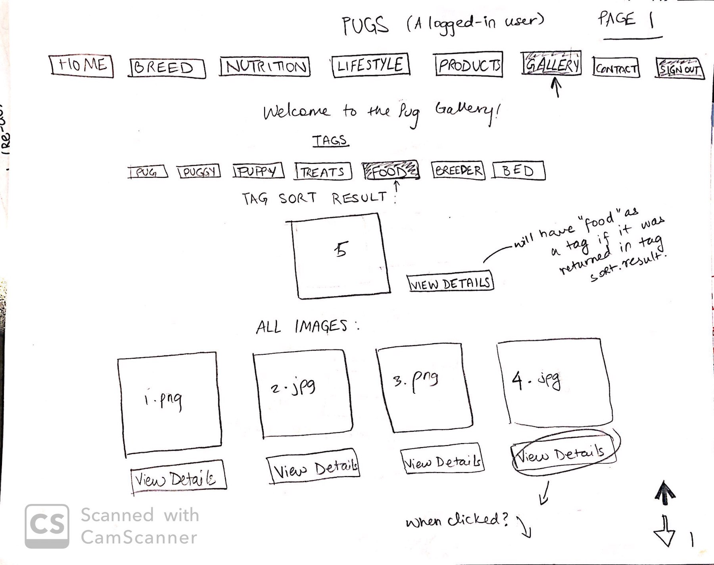
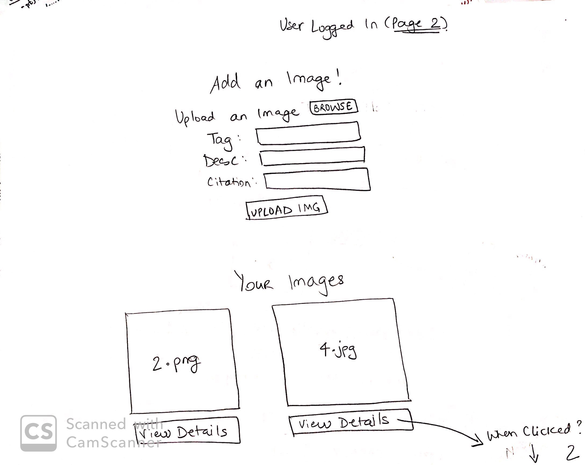
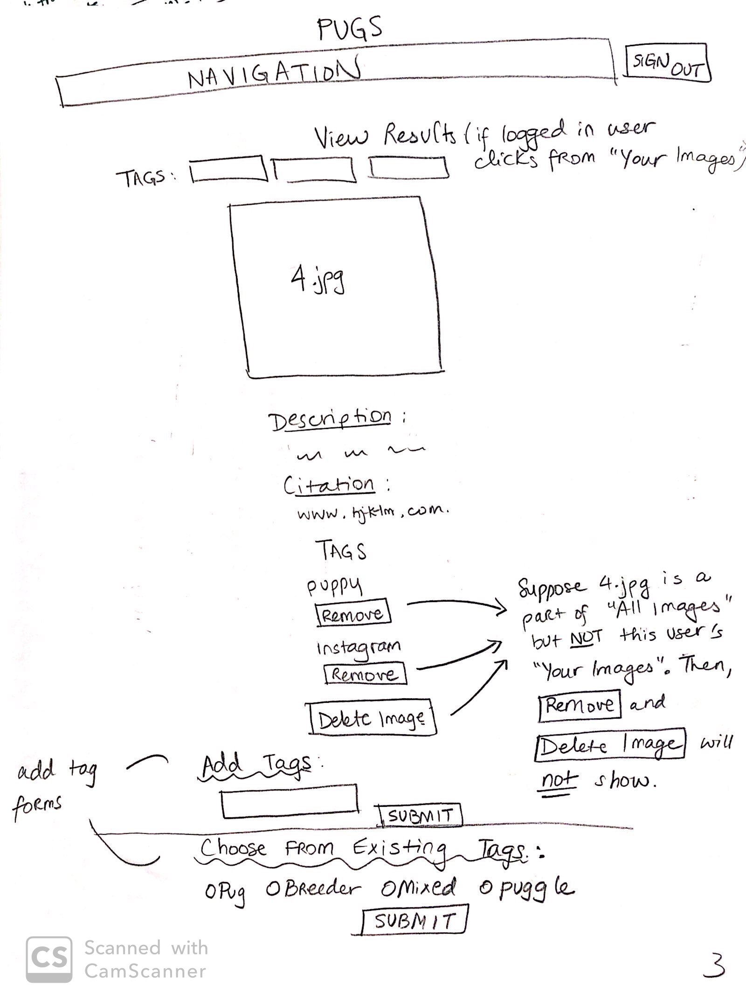
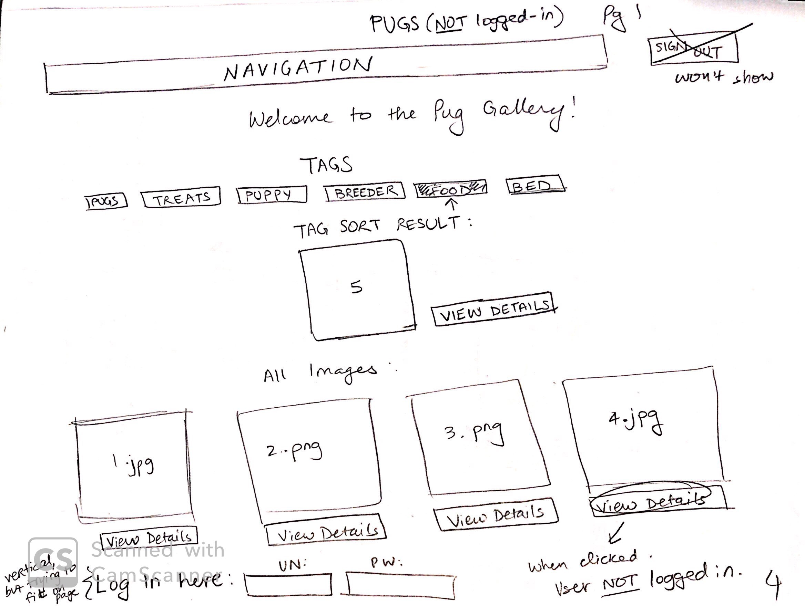
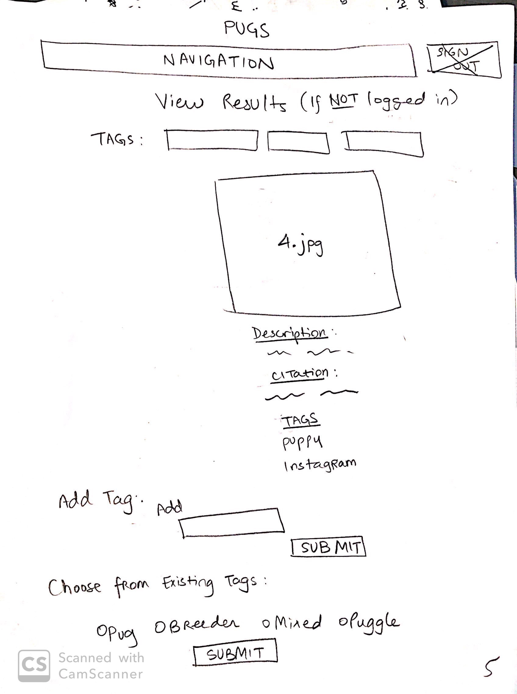
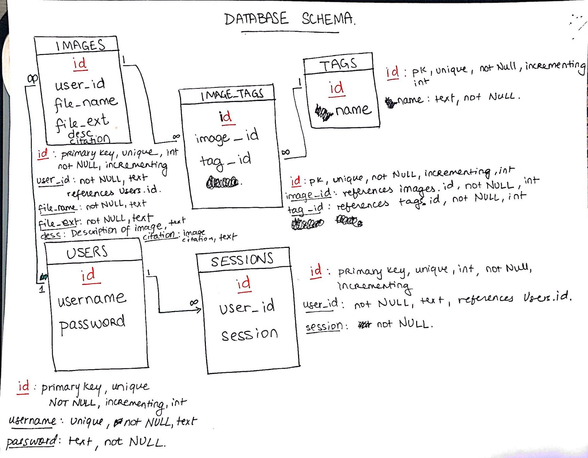

# Project 3: Design Journey

Your Name: Nighat Ansari

**All images must be visible in Markdown Preview. No credit will be provided for images in your repository that are not properly linked in Markdown. Assume all file paths are case sensitive!**

# Project 3, Milestone 1 - Design, Plan, & Draft Website

## Describe your Gallery

[What will your gallery be about? 1 sentence.]

I am building my page off of my Project 1 website, so my image gallery will be contain different pug products, breeders, and puppies.

## Target Audiences

[Tell us about your target two audiences. ~1-3 sentences per audience]

As per my project 1, which was designed to appeal to prospective and current pug dog owners, this gallery will also be designed for the same two audiences. I am hoping this gallery will serve more as a "blog" for users on my website to share photos of their pugs, the products they use, and the breeders they liked. This appeals to both the prospective pug owners (who want to learn more about the breed and breeders) and current pug owners (who want recommendations on products).


## Design Process

[Document your design process. Show us the evolution of your design from your first idea (sketch) to design you wish to implement (sketch). Show us the process you used to organize content and plan the navigation (e.g. card sorting).]

[Label all images. All labels must be visible in Markdown Preview.]


**Brainstorming of the Gallery Page Layout: Two Options**

I chose the second option, except instead of arrows, all images are displayed almost in a grid. The project requires that all images be displayed and visible at the same time, so I felt that choice 2 with a modification would be best.



## Final Design Plan

[Include sketches of your final design here.]


This page shows what the gallery will look like when the user is logged in



When user logged in, page 2



when user logged in and clicks View Details



When user is not logged in


When user is not logged in and clicks View Details


## Templates

[Identify the templates you will use on your site.]

The templates I am using will be the same as my Project 1 website because my navigation (contained in header.php), footer (in the footer.php file), and head tags (in the head.php file) are all staying the same on this webpage.


## Database Schema Design

[Describe the structure of your database. You may use words or a picture. A bulleted list is probably the simplest way to do this. Make sure you include constraints for each field.]

[Hint: You probably need `users`, `images`, `tags`, and `image_tags` tables.]

[Hint: For foreign keys, use the singular name of the table + _id. For example: 1) `user_id` in the `images` table or 2) `image_id` and `tag_id` for the `image_tags` table.]

```
movies (
id : INTEGER {PK, U, Not, AI} -- surrogate primary key
field2 : ...
...
)
```
**Database schema and field constraints for tables**
Here are my tables and foreign key mappings. I also mention constraints on my fields.



## Code Planning

Below is my detailed pseudocode for the project. It helps me more to understand my code in English rather than just writing it in programming syntax, so that is why I used paragraphs to walk through the steps:

**Database**
1) Create database gallery.sqlite in init.sql
2) Add tables and populate with seed data.
3) We will have a tags table, image_tags table, users table, sessions table, and an images table.

**Gallery.php**
This page will:
    -Display all tags
    -Display all images
    -Give any user the ability to add tags to any images.
    -Have the option to login if the user isn't logged in already.
        -If the user logs in, then they can upload images.
        -If the user logs in, then they can delete tags only on their images.

    -Sort by tags to show all images with that tag.
    -Have each image be clickable to reveal additional details.

**Display Gallery:**

Query the images table database to return images in the gallery. Use a submit button contained in a form to be later accessed through a GET request. This button will help navigate to details. This button can be used to store the id of the image, which will then help us query the database and return specific details about the image (next section).

**Displaying Individual Details**

If the user presses button to navigate to details, store image id of the image as a button (as a GET request).

  Use this stored image_id to narrow down results in a sql query done to image_tags. After you store this information, echo the output that image_tags gives at this image_id. In other words, there will be image details stored in image tags (such as description and citation), so output those.

  *Tags*
  Use an array combined with a separate query to get tags. Look through image_tags and find what tags correspond to this image. Store them in an array and display them using a "for-loop".


**Tag Sort**

First, get all your unique tag names using a query through the Tags table and use a foreach loop to output a form with a submit button for each tag on the page. This will show all tags in your database and make them clickable so they can send information to be stored.

Once you have these tags, GET your submit button for the form above and in it, store the name or id of the tag in it. Later, you can access this using a GET request and store it as a variable. Once you have this stored as a variable, query the image tags table to see which images have this tag corresponding to them. Display/Output these images as another gallery and set their  "View details button" to the same form as the Individual Details form in the first section.

**Deleting Images or Tags**

This functionality is only provided to someone logged in, so check to see if the user is logged in. If yes, also check to see what user they are (as only owners of images can delete tags or images). If the user is correct and they are logged in, then display delete button for both options (use hidden classes). If the button is clicked, then use a GET request so store the image id. We can then remove the image first from the images table. Once that query is successful, we can proceed to remove it from the image_tags table. Finally, we can remove it from our uploads folder using PHP's unlink function.

For deleting tags, display a delete button when login constraints (above) are met. Once the user is logged in, through hidden classes, show them the delete button. Once the user hits delete, remove the tag from the user in the image_tags table. Even if an image has no tags, still display  it.

**Uploading Images**

To upload images, create a post encrypted form that allows users to upload an image, provide a tag, provide a description, provide a citation. Have a submit button that stores information about the uploaded image. When the user hits upload, filter their input and sanitize it. After filtering input, store it in variables. Add the inputted tag to the table table through an insert query. After doing the tag insert, do an image insert with the inputted file name. Be careful to extract the image file extension. Using basename, and pathinfo, store the name and extension of the file. After this, upload the image to your "uploads/images" folder with the name "image_id.image_extention". If both adding tag and adding image is successful, then add both ids and information into the image_tags table.

**Adding Tags**
Create another form (this can use a GET request) that takes in an input from the user. This input is the tag the user wants to add. Store this tag through a GET request. Either in the same form or a different form, add the ability to choose pre-existing tags that can also be added to the image. Store this in a GET request as well. Check to see if the added tag is (1) unique and (2) Not already attached to the image we are adding it to. Maintain two separate booleans to do this. Once both are satisfied, then add the tag to the image. Otherwise, don't add the tag.


## Database Query Plan

[Plan your database queries. You may use natural language, pseudocode, or SQL.]

1. Creating a table (example):
    ```sql
    CREATE TABLE images(
      id INTEGER NOT NULL PRIMARY KEY AUTOINCREMENT UNIQUE,
      user_id FLOAT NOT NULL,
	    imgtag_id FLOAT NOT NULL
    );
    ```

2. Adding image to the database/adding record to tags table:

  ```sql
    INSERT INTO images (id, file_name, file_ext, desc, citation) VALUES (id, 'name.jpg', 'jpg', 'A pug!', 'wwww.instagram.com/helmutthepug');

    INSERT INTO tags (id, name) VALUES (...)
  ```

3. Getting all images with information (description, tags) from the database:

```sql
   SELECT * FROM image_tags INNER JOIN images ON (images.id = image_tags.image_id) INNER JOIN  tags
   ON (tags.id = image_tags.tag_id);
```

4. When a user wants to see images with a specific tag and they click on a button named 'tag_submit'. All image information such as tags and description should also display along with the image:

```sql
    SELECT * FROM image_tags INNER JOIN images ON (image_tags.image_id = images.id)INNER JOIN tags ON (image_tags.tag_id = tags.id) WHERE tags.name = :tag_submit;
```

5. Deleting Tags
  $delete_img = $_POST["delete_image"];
```sql
    DELETE FROM image_tags WHERE image_tags.tag_id = :delete_tag;
```
6. Deleting Images
  $delete_img = $_POST["delete_image"];
```sql
    1. From images: DELETE FROM images WHERE id = :del_img;
    2. From image_tags: DELETE FROM image_tags WHERE image_id = :del_img;
```

7. Tag Sort

$input_tag = $_GET['tag_submit'];
```sql
    SELECT * FROM image_tags INNER JOIN tags ON (image_tags.tag_id = tags.id) INNER JOIN images ON (images.id = image_tags.image_id) WHERE tags.name = :tag_submit;
```


# Project 3, Milestone 2 - Gallery and User Access Controls

## Issues & Challenges

[Tell us about any issues or challenges you faced while trying to complete milestone 2. 2-4 sentences/bullet points]

-This milestone was particularly difficult for me given that there were so many components that needed to be implemented. In order for one to work, many different components needed to work. It was immensely difficult to debug (and I still haven't been able to fully debug issues). Going to Office Hours wasn helpful in guiding me to get back on the right track, but the help was limited since there were so many other students who needed help. So, thinking through very vague problems on my own was the most challenging aspect of this milestone.

-I am still struggling to conceptualize how tags will need to be implemented, but I think understanding the database in depth will be helpful before I write any queries.


# Final Submission: Complete & Polished Website

## Reflection

[Take this time to reflect on what you learned during this assignment. How have you improved since starting this class? 2-4 sentences]

This assignment was incredibly overwhelming at first. There were so many requirements to fulfil and often when I got one requirement to work, the others fell apart. I was challenged by this project throughout every step, but I am very proud of what I have accomplished. I understand databases, PHP, and SQL significantly better and can think through all the logic before I code it. I felt that by the end of this project, I was so comfortable debugging and monitoring my code, intuivitely recognizing what was wrong, and using documentation.
